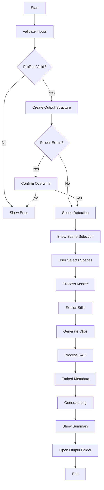

# Video Archive Tool - Technical Specification v1.0
## Yambo Studio - Video Processing & Archive Automation

---

## 1. PROJECT OVERVIEW

### 1.1 Purpose
A desktop automation tool for preparing video assets for Webflow upload and intelligent project archiving, optimized for creative studios working with high-quality video content.

### 1.2 Core Functionality
- Process ProRes master videos (15-90 seconds typical)
- Auto-detect scene cuts and allow user grouping
- Generate web-optimized and high-quality archive assets
- Process R&D materials (images and videos)
- Organize outputs in standardized folder structure

### 1.3 Target Platform
- **OS**: Windows 10/11 (x64)
- **GPU**: NVIDIA RTX 4090/5090 (CUDA acceleration)
- **Distribution**: Portable folder with Run.bat launcher

---

## 2. TECHNICAL ARCHITECTURE

### 2.1 Technology Stack
```
Core:
├── Python 3.11+ (embedded)
├── Tkinter (GUI)
├── FFmpeg 6.0+ (bundled)
├── PySceneDetect 0.6+
├── OpenCV 4.8+ (with CUDA)
├── Pillow 10.0+ (image processing)
└── SQLite3 (state persistence)

Distribution:
├── PyInstaller (executable)
├── App/ directory structure
└── Run.bat launcher
```

### 2.2 Application Structure
```
VideoArchiveTool/
├── Run.bat                    # Application launcher
├── App/
│   ├── VideoArchiveTool.exe   # Main executable
│   ├── ffmpeg/                # FFmpeg binaries
│   │   ├── ffmpeg.exe
│   │   └── ffprobe.exe
│   ├── config/
│   │   ├── settings.json      # User settings
│   │   ├── presets.json       # Compression presets
│   │   └── state.db           # Resume state (SQLite)
│   └── logs/
│       └── process_log.txt
└── README.txt
```

### 2.3 Core Components

#### Processing Engine
```python
class VideoProcessor:
    - ProRes validation & optimization
    - Scene detection with PySceneDetect
    - Frame extraction (GPU-accelerated)
    - Video clip generation
    - Metadata embedding
```

#### Image Processor
```python
class ImageProcessor:
    - PNG generation (lossless)
    - JPEG compression (quality-controlled)
    - Aspect ratio detection
    - Batch processing with CUDA
    - Copyright metadata injection
```

#### State Manager
```python
class StateManager:
    - SQLite database for resume capability
    - Progress tracking per operation
    - Cancellation handling
    - Cleanup operations
```

---

## 3. FUNCTIONAL REQUIREMENTS

### 3.1 Input Processing

#### Master Video Requirements
- **Supported Formats**: ProRes 422, ProRes 4444
- **Duration**: 15-90 seconds (typical), no hard limits
- **Validation**:
  - Codec verification
  - Corruption check via ffprobe
  - Color space detection

#### R&D Folder Processing
- **Input Types**: Mixed images (PNG, JPG, TIFF) and videos (MOV, MP4, AVI)
- **Processing**:
  - Flatten structure (no subfolder preservation)
  - Convert all to standardized formats
  - Handle naming conflicts with incremental suffixes

### 3.2 Scene Detection

#### Detection Method
```python
# PySceneDetect configuration
detector = ContentDetector(
    threshold=30.0,  # Configurable via GUI
    min_scene_len=15  # Minimum 0.5 second scenes
)
```

#### User Interaction
- List view with thumbnails
- Checkbox selection
- "Group Selected" button
- Seamless concatenation (no black frames)
- Timeline preview with timestamps

### 3.3 Output Generation

#### Folder Structure
```
YY-MM-DD_ArtworkName/
├── Masters/
│   ├── original.mov
│   └── optimized.mp4
├── Video-clips/
│   ├── ArtworkName_clip_01.mp4
│   └── ArtworkName_grouped_01-03.mp4
├── Stills/
│   ├── HQ/
│   │   └── ArtworkName_HQ_01_16x9.png
│   └── Compressed/
│       └── ArtworkName_compressed_01_16x9.jpg
└── R&D/
    ├── High-res/
    │   ├── reference_01.png
    │   └── concept_01.png
    └── Compressed/
        ├── reference_01.jpg
        └── concept_01.mp4
```

#### Naming Convention
```
Format: {ArtworkName}_{type}_{sequence}_{aspectRatio}.{ext}

Examples:
- ArtworkName_HQ_01_16x9.png
- ArtworkName_compressed_02_9x16.jpg
- ArtworkName_clip_01.mp4
- ArtworkName_grouped_01-05.mp4
```

#### Aspect Ratio Detection
```python
def detect_aspect_ratio(width, height):
    ratio = width / height
    if abs(ratio - 16/9) < 0.1: return "16x9"
    elif abs(ratio - 9/16) < 0.1: return "9x16"
    elif abs(ratio - 1) < 0.1: return "1x1"
    elif abs(ratio - 4/3) < 0.1: return "4x3"
    else: return f"{width}x{height}"
```

### 3.4 Compression Presets

#### Built-in Presets

**1. Webflow Standard**
```json
{
  "name": "Webflow Standard",
  "stills_hq": {
    "format": "PNG",
    "resolution": "source"
  },
  "stills_web": {
    "format": "JPEG",
    "quality": 90,
    "resolution": "source"
  },
  "video": {
    "codec": "h264",
    "resolution": "source",
    "crf": 20,
    "profile": "high",
    "audio": "aac_320kbps",
    "fps": "source"
  }
}
```

**2. Retina/Web Showcase**
```json
{
  "name": "Retina/Web Showcase",
  "stills_hq": {
    "format": "PNG",
    "resolution": "source"
  },
  "stills_web": {
    "format": "JPEG",
    "quality": 90,
    "max_width": 2560,
    "progressive": true,
    "color_space": "sRGB"
  },
  "video": {
    "codec": "h264",
    "resolution": "1440p",
    "crf": 19,
    "profile": "high",
    "audio": "aac_320kbps"
  }
}
```

**3. Ultra-Light Web**
```json
{
  "name": "Ultra-Light Web",
  "stills_web": {
    "format": "JPEG",
    "quality": 82,
    "max_width": 1600,
    "progressive": true,
    "color_space": "sRGB"
  },
  "thumbnails_only": true
}
```

### 3.5 Metadata Embedding

```python
metadata = {
    "Copyright": "© Yambo Studio",
    "Creator": "Yambo Studio Video Archive Tool",
    "Source": source_file_path,
    "ProcessingDate": datetime.now().isoformat(),
    "CompressionSettings": preset_name,
    "ArtworkName": artwork_name,
    "FrameNumber": frame_num,  # For stills
    "ColorSpace": color_space_info
}
```

---

## 4. USER INTERFACE DESIGN

### 4.1 Main Window Layout

```
┌─────────────────────────────────────────────────────────┐
│  Video Archive Tool - Yambo Studio                      │
├─────────────────────────────────────────────────────────┤
│                                                          │
│  PROJECT SETUP                                          │
│  ┌────────────────────────────────────────────────┐    │
│  │ Artwork Name: [_______________]                 │    │
│  │ Date: [YY-MM-DD ▼]  📅                         │    │
│  └────────────────────────────────────────────────┘    │
│                                                          │
│  INPUT FILES                                            │
│  ┌────────────────────────────────────────────────┐    │
│  │ Master Video: [________________] [Browse]       │    │
│  │ ✓ ProRes 422 validated                         │    │
│  │                                                  │    │
│  │ R&D Folder: [_________________] [Browse]        │    │
│  │ 15 images, 3 videos found                      │    │
│  └────────────────────────────────────────────────┘    │
│                                                          │
│  COMPRESSION PRESET                                     │
│  ┌────────────────────────────────────────────────┐    │
│  │ [▼ Webflow Standard              ]               │    │
│  │ [ ] Custom Settings...                          │    │
│  └────────────────────────────────────────────────┘    │
│                                                          │
│  [▼ Advanced Settings]                                  │
│                                                          │
│  ┌───────────────────────────────┐                     │
│  │        [PROCESS]               │                     │
│  └───────────────────────────────┘                     │
│                                                          │
└─────────────────────────────────────────────────────────┘
```

### 4.2 Advanced Settings Panel (Collapsible)

```
┌─────────────────────────────────────────────────────────┐
│  ▼ Advanced Settings                                    │
├─────────────────────────────────────────────────────────┤
│                                                          │
│  SCENE DETECTION                                        │
│  Cut Detection Threshold: [30] ──────●────── Sensitive  │
│  Min Scene Length (frames): [15]                        │
│                                                          │
│  ENCODING                                               │
│  ○ x264 (CPU - Higher Quality)                          │
│  ● NVENC (GPU - Faster)                                 │
│                                                          │
│  OUTPUT OPTIONS                                         │
│  ☑ Generate Stills from Midpoint                        │
│  ☑ Create Process Log                                   │
│  ☑ Open Output Folder on Completion                    │
│                                                          │
└─────────────────────────────────────────────────────────┘
```

### 4.3 Scene Selection Window

```
┌─────────────────────────────────────────────────────────┐
│  Scene Detection - Select Clips to Export               │
├─────────────────────────────────────────────────────────┤
│                                                          │
│  Detected 12 scenes in video:                           │
│                                                          │
│  ┌─────────────────────────────────────────────────┐   │
│  │ ☑ Scene 1  [thumb] 00:00-00:03 (3.0s)          │   │
│  │ ☑ Scene 2  [thumb] 00:03-00:07 (4.0s)          │   │
│  │ ☐ Scene 3  [thumb] 00:07-00:09 (2.0s)          │   │
│  │ ☑ Scene 4  [thumb] 00:09-00:15 (6.0s)          │   │
│  │ ☑ Scene 5  [thumb] 00:15-00:22 (7.0s)          │   │
│  └─────────────────────────────────────────────────┘   │
│                                                          │
│  Selected: 4 scenes (20.0s total)                       │
│                                                          │
│  [Group Selected] [Export Individual] [Select All]      │
│                                                          │
│  [Cancel]                            [Export]           │
│                                                          │
└─────────────────────────────────────────────────────────┘
```

### 4.4 Progress Window

```
┌─────────────────────────────────────────────────────────┐
│  Processing - Yambo Studio Video Archive                │
├─────────────────────────────────────────────────────────┤
│                                                          │
│  Overall Progress:                                      │
│  ████████████████████░░░░░░░░░  65%                   │
│                                                          │
│  Current Operation: Extracting Stills                   │
│  ██████████████████████████████  100% (12/12)         │
│                                                          │
│  Details:                                               │
│  ┌─────────────────────────────────────────────────┐   │
│  │ ✓ Scene detection complete (12 scenes)          │   │
│  │ ✓ Master optimization complete                  │   │
│  │ ⟳ Extracting stills... (12/12)                 │   │
│  │ ○ Generating video clips                        │   │
│  │ ○ Processing R&D folder                         │   │
│  └─────────────────────────────────────────────────┘   │
│                                                          │
│  Time Elapsed: 00:02:45  |  Estimated: 00:01:30        │
│                                                          │
│  [Pause]                              [Cancel]          │
│                                                          │
└─────────────────────────────────────────────────────────┘
```

---

## 5. PROCESSING PIPELINE

### 5.1 Execution Flow



### 5.2 GPU Acceleration Strategy

```python
class GPUAccelerator:
    def __init__(self):
        self.cuda_available = self.check_cuda()
        self.encoder = "h264_nvenc" if self.cuda_available else "libx264"

    def check_cuda(self):
        try:
            # Check for CUDA-capable GPU
            import cv2
            cv2.cuda.getCudaEnabledDeviceCount() > 0
            # Verify FFmpeg NVENC support
            result = subprocess.run(
                ["ffmpeg", "-encoders"],
                capture_output=True
            )
            return "h264_nvenc" in result.stdout.decode()
        except:
            return False

    def get_ffmpeg_params(self, quality_preset):
        if self.cuda_available:
            return [
                "-hwaccel", "cuda",
                "-c:v", "h264_nvenc",
                "-preset", "p7",  # Highest quality
                "-rc:v", "vbr",
                "-cq:v", str(quality_preset.crf)
            ]
        else:
            return [
                "-c:v", "libx264",
                "-preset", "slower",
                "-crf", str(quality_preset.crf)
            ]
```

### 5.3 Color Preservation

```python
def extract_frame_native_color(video_path, timestamp):
    """Extract frame without color space conversion"""
    cmd = [
        "ffmpeg",
        "-ss", str(timestamp),
        "-i", video_path,
        "-frames:v", "1",
        "-vf", "scale=in_color_matrix=auto:out_color_matrix=auto",
        "-color_primaries", "copy",
        "-color_trc", "copy",
        "-colorspace", "copy",
        "-f", "image2pipe",
        "-vcodec", "png",
        "-"
    ]
    # Process maintains original color space
```

---

## 6. STATE MANAGEMENT & RESUME

### 6.1 Database Schema

```sql
-- State persistence for resume capability
CREATE TABLE processing_state (
    id INTEGER PRIMARY KEY,
    session_id TEXT UNIQUE,
    artwork_name TEXT,
    master_path TEXT,
    rd_path TEXT,
    output_path TEXT,
    preset TEXT,
    total_operations INTEGER,
    completed_operations INTEGER,
    current_operation TEXT,
    scenes_data TEXT,  -- JSON
    created_at TIMESTAMP,
    updated_at TIMESTAMP
);

CREATE TABLE operation_log (
    id INTEGER PRIMARY KEY,
    session_id TEXT,
    operation TEXT,
    status TEXT,
    details TEXT,
    timestamp TIMESTAMP,
    FOREIGN KEY (session_id) REFERENCES processing_state(session_id)
);
```

### 6.2 Resume Logic

```python
class StateManager:
    def save_state(self, operation):
        """Save current state after each major operation"""
        self.db.execute("""
            UPDATE processing_state
            SET current_operation = ?,
                completed_operations = completed_operations + 1,
                updated_at = CURRENT_TIMESTAMP
            WHERE session_id = ?
        """, (operation, self.session_id))

    def check_resume(self):
        """Check for incomplete sessions on startup"""
        incomplete = self.db.execute("""
            SELECT * FROM processing_state
            WHERE completed_operations < total_operations
            ORDER BY updated_at DESC LIMIT 1
        """).fetchone()

        if incomplete:
            return self.prompt_resume(incomplete)
        return None
```

---

## 7. ERROR HANDLING

### 7.1 Error Categories

```python
class ErrorHandler:
    ERROR_TYPES = {
        "VALIDATION": {
            "INVALID_PRORES": "File is not a valid ProRes video",
            "CORRUPT_FILE": "Video file appears corrupted",
            "NO_CUDA": "GPU acceleration unavailable, falling back to CPU"
        },
        "PROCESSING": {
            "SCENE_DETECTION_FAILED": "Could not detect scenes",
            "ENCODING_FAILED": "Video encoding failed",
            "DISK_FULL": "Insufficient disk space"
        },
        "SYSTEM": {
            "FFMPEG_MISSING": "FFmpeg not found in App folder",
            "PERMISSION_DENIED": "Cannot write to output directory"
        }
    }
```

### 7.2 Fallback Strategies

1. **GPU → CPU Fallback**: Automatic with user notification
2. **Scene Detection Failure**: Manual scene marking option
3. **Encoding Failure**: Retry with conservative settings
4. **Partial Completion**: Save state for manual recovery

---

## 8. PERFORMANCE OPTIMIZATION

### 8.1 Benchmarks & Targets

| Operation | Target Time (30s 4K ProRes) | Method |
|-----------|--------------------------|---------|
| Scene Detection | < 5 seconds | PySceneDetect with frame skipping |
| Master Optimization | < 20 seconds | NVENC GPU encoding |
| Still Extraction (10 scenes) | < 10 seconds | Parallel GPU processing |
| Clip Generation (5 clips) | < 15 seconds | NVENC batch encoding |
| R&D Processing (20 files) | < 30 seconds | Parallel CPU+GPU |

### 8.2 Optimization Strategies

```python
# Parallel processing for stills
from concurrent.futures import ThreadPoolExecutor

def process_stills_parallel(frames, max_workers=4):
    with ThreadPoolExecutor(max_workers=max_workers) as executor:
        futures = [
            executor.submit(process_still, frame)
            for frame in frames
        ]
        return [f.result() for f in futures]

# Batch encoding for video clips
def batch_encode_clips(clips):
    # Use FFmpeg concat for seamless joins
    # Single encoding pass for grouped clips
```

---

## 9. LOGGING & REPORTING

### 9.1 Process Log Format

```
===========================================
VIDEO ARCHIVE TOOL - PROCESS LOG
===========================================
Date: 2024-12-20 14:30:00
Session ID: vat_20241220_143000_xyz

PROJECT DETAILS:
- Artwork Name: MyProject
- Master Video: project_master.mov
  - Duration: 45.5 seconds
  - Resolution: 3840x2160
  - Codec: ProRes 422
  - FPS: 30

PROCESSING SUMMARY:
✓ Scene Detection: 12 scenes detected
✓ Master Optimization: Completed (18.3 MB → 4.2 MB)
✓ Stills Generated: 24 files (12 PNG, 12 JPEG)
✓ Video Clips: 8 files (5 individual, 3 grouped)
✓ R&D Processing: 15 images, 3 videos processed

OUTPUT STATISTICS:
- Total Files Created: 50
- Total Size: 145.6 MB
- Processing Time: 00:03:45

METADATA:
- Copyright: © Yambo Studio
- Color Space: Preserved from source
- Encoding: x264 (CPU)

ERRORS/WARNINGS:
- None

OUTPUT LOCATION:
D:\Projects\24-12-20_MyProject\

Process completed successfully.
===========================================
```

---

## 10. TESTING REQUIREMENTS

### 10.1 Test Scenarios

1. **ProRes Validation**
   - Valid ProRes 422/4444
   - Corrupted files
   - Non-ProRes files

2. **Scene Detection**
   - Simple cuts
   - Single-scene videos
   - Rapid cuts (>30 per minute)

3. **GPU Acceleration**
   - CUDA available
   - CUDA unavailable
   - Mid-process GPU failure

4. **Resume Capability**
   - Clean cancellation
   - Crash recovery
   - Partial completion

5. **Edge Cases**
   - Very short videos (<5s)
   - Very long videos (>5min)
   - 8K resolution
   - Mixed frame rates

---

## 11. DEPLOYMENT

### 11.1 Build Process

```batch
:: build.bat
@echo off
echo Building Video Archive Tool...

:: Create virtual environment
python -m venv venv
call venv\Scripts\activate

:: Install dependencies
pip install -r requirements.txt

:: Build executable
pyinstaller --onefile ^
    --add-data "assets;assets" ^
    --hidden-import tkinter ^
    --icon=icon.ico ^
    --name VideoArchiveTool ^
    src/main.py

:: Copy dependencies
xcopy /s ffmpeg App\ffmpeg\
copy VideoArchiveTool.exe App\

:: Create launcher
echo @echo off > Run.bat
echo cd App >> Run.bat
echo start VideoArchiveTool.exe >> Run.bat

echo Build complete!
```

### 11.2 Distribution Structure

```
VideoArchiveTool_v1.0/
├── Run.bat
├── App/
│   ├── VideoArchiveTool.exe
│   ├── ffmpeg/
│   ├── config/
│   └── logs/
├── README.txt
└── LICENSE.txt
```

---

## 12. FUTURE ENHANCEMENTS

### Phase 2 Possibilities
- AI-powered scene grouping (mood analysis)
- Batch processing queue
- Cloud upload integration
- Advanced color grading preservation
- Multi-language support
- Network rendering support

### Phase 3 Considerations
- Web interface option
- Collaborative features
- Asset management database
- Automated backup to cloud
- Plugin system for custom workflows

---

## APPENDIX A: Configuration Files

### settings.json
```json
{
  "version": "1.0.0",
  "last_output_dir": "",
  "default_preset": "Webflow Standard",
  "scene_threshold": 30,
  "min_scene_length": 15,
  "encoder_preference": "x264",
  "auto_open_output": true,
  "generate_log": true,
  "extract_midpoint_stills": true,
  "copyright": "© Yambo Studio"
}
```

### presets.json
```json
{
  "presets": [
    {
      "id": "webflow_standard",
      "name": "Webflow Standard",
      "editable": false,
      "settings": { ... }
    },
    {
      "id": "custom_001",
      "name": "My Custom Preset",
      "editable": true,
      "settings": { ... }
    }
  ]
}
```

---

*Document Version: 1.0*
*Last Updated: December 2024*
*Author: Yambo Studio Technical Team*